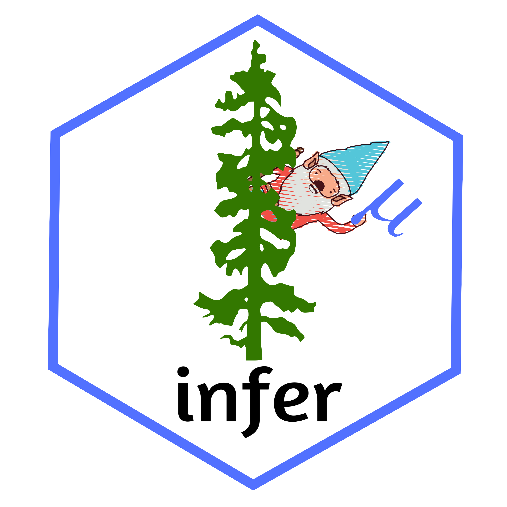

```{r setup, include=FALSE}
htmltools::tagList(rmarkdown::html_dependency_font_awesome())
knitr::opts_chunk$set(echo = TRUE, warning=FALSE, message=FALSE, fig.width=12, fig.height=5)
```

class: inverse, middle

# Large-scale interactives for <br />large-enrolment courses
## Anna Fergusson <br />University of Auckland

<i class="fa fa-twitter fa-2x"></i> @annafergussonnz  

---
background-image: url(opportunities.png)
background-size: cover

--
.highlight-box[
## Reasons why it's awesome to teach large lectures!
]

---
class: left, inverse
background-image: url(fandp.jpg)
background-size: cover

.footnote[
[Photo by Kim Carter](https://www.owasp.org/index.php/OWASP_New_Zealand_Day_2016)
]

# Limitations

---
class: left, inverse
background-image: url(fandp.jpg)
background-size: cover

.footnote[
[Photo by Kim Carter](https://www.owasp.org/index.php/OWASP_New_Zealand_Day_2016)
]

# <s>Limitations</s> Opportunities

---
class: center, middle, inverse
  
.shout-out[   
#### Go big or go home!
]

---
#Things that can work well with large classes<sup>*</sup>

.footnote[
<sup>*</sup> See the [GAISE College Report 2016](http://www.amstat.org/asa/files/pdfs/GAISE/GaiseCollege_Full.pdf)
]

--

- personal response systems (clickers) 

--

- web surveys (google forms or similar)  

--

- student-instructor & student-student interactions 

--

- phones/laptops (visualisations/applets)  

--

.highlight-box[
# What happens if you put <br />all these things together?
]

---
class: inverse, middle, center

.shout-out[
####TMI<sup>*</sup>
]

<sup>*</sup>Too Many Interactives

---
class: middle, center

## So I'll focus on <s>some</s> one large-scale interactive<s>s</s> designed to support simulation-based inference

---
#Does caffeine have a stimulus effect?


.footnote[
Modified from Watkins, A., Scheaffer, R. & Cobb, R. (2010). *Statistics From Data to Decision*, (2nd ed.). Wiley. 
]

---
class: middle, center
background-image: url(trump.PNG)

---
class: inverse, middle, center

# Legal phone tapping

---
class: center

# Flip a "coin"

## heads = group A

## tails = group B

---
class: center, middle

<iframe width="560" height="315" src="https://www.youtube.com/embed/sDvcuLmcOq8" frameborder="0" allow="autoplay; encrypted-media" allowfullscreen></iframe>

---
class: center, middle

## Select whether you are in group A or B and then send your tapp result through

---

<iframe src="https://docs.google.com/spreadsheets/d/e/2PACX-1vQnyQFxXJKPECSUETE5w2zsSXDtnffapovB9Ru3XaW0h29fkOrGbZE0URZQNw4A9Ct30ZXfCiSWSexg/pubhtml?gid=748997953&amp;single=true&amp;widget=true&amp;headers=false" width="100%" height="100%" frameborder="0"></iframe>

---
.pull-left[

## Publish a google sheet as a csv file


]

.pull-right[

## Use link within iNZight lite


]
---

<iframe style="margin:0 auto; min-width: 100%;" class="interactive" src="https://byoc.docker.stat.auckland.ac.nz?code=https://raw.githubusercontent.com/annafergusson/LSinteractives/master/docs/slides_updated/code1.R" scrolling="no" frameborder="no">
</iframe>

---

<iframe style="margin:0 auto; min-width: 100%;" class="interactive" src="https://byoc.docker.stat.auckland.ac.nz?code=https://raw.githubusercontent.com/annafergusson/LSinteractives/master/docs/slides_updated/code2.R" scrolling="no" frameborder="no">
</iframe>

---
class: middle, center

# Flip a "coin" again

## heads = group A

## tails = group B

## re-select your group and send through your result again

---

<iframe style="margin:0 auto; min-width: 100%;" class="interactive" src="https://byoc.docker.stat.auckland.ac.nz?code=https://raw.githubusercontent.com/annafergusson/LSinteractives/master/docs/slides_updated/code3.R" scrolling="no" frameborder="no">
</iframe>

---
class: center

Example of bigger lineup


---
class: middle, center, inverse


## visual inference using the lineup protocol

Hadley Wickham, Niladri Roy Chowdhury and Di Cook (2014). nullabor: Tools for Graphical Inference. R package version 0.3.1. https://CRAN.R-project.org/package=nullabor

https://cran.r-project.org/web/packages/nullabor/vignettes/nullabor.html

---
class: inverse, center, middle


---
#Does caffeine have a stimulus effect?


.footnote[
Modified from Watkins, A., Scheaffer, R. & Cobb, R. (2010). *Statistics From Data to Decision*, (2nd ed.). Wiley. 
]

---
class: center, middle

<iframe width="560" height="315" src="https://www.youtube.com/embed/qAx9dw7sFn0" frameborder="0" allow="autoplay; encrypted-media" allowfullscreen></iframe>

---
class: center

<iframe width="560" height="315" src="https://www.youtube.com/embed/rLg9o6usXAk" frameborder="0" allow="autoplay; encrypted-media" allowfullscreen></iframe>

.footnote[
See VIT (Visual Inference Tools) https://www.stat.auckland.ac.nz/~wild/VIT/downloads.html

VIT is led by Chris Wild. Work on program infrastructure was begun by Garrett Grolemund (who also came up with the name "Visual Inference Tools"). 
]

---
class: center

# VIT + infer<sup>*</sup> = awesome

.pull-left[

]

.pull-right[

]

.footnote[
Andrew Bray, Chester Ismay, Ben Baumer and Mine Cetinkaya-Rundel (2018). infer: Tidy Statistical Inference. R package version 0.2.0. https://CRAN.R-project.org/package=infer

http://infer.netlify.com/index.html
]

---
# What helps make large-scale interactives successful?

--

- use of a link sharing system for quick transitions e.g. slinky app

--

- using a modular approach rather than a "one stop shop" e.g. data saved in Google sheet

--

- apps that accept public csv links as part of the URL e.g. https://www.stat.auckland.ac.nz/~wild/VITonline/RandomisationVar/RVar.html?file=link_to_csv

--

- not hiding too many actions "behind the scenes"

--

- collect data on as many "variables" as you can even if you don't need it for the thing you designed the app for

--

- back up plans!

---
class: middle, center, inverse
# How to get started?

---
# Use google forms

--

.pull-left[


]

--

.pull-right[

]

---
# Use shiny apps


.footnote[
Image and app: https://jhubiostatistics.shinyapps.io/cast_spells/

For more info about this app, see
http://nickstrayer.me/dataDayTexas/ 

Also check out Nick Strayer's shinysense package: https://github.com/nstrayer/shinysense
]

---
# Take something analog and make digital

<center>

</center>

.footnote[
Interactive adapted from the circle sampling activity from Franklin, C., Kader, G., Mewborn, D., Moreno, J., Peck, R., Perry, M., & Scheaffer, R. (2007). Guidelines for assessment and instruction in statistics education (GAISE) report. Alexandria: American Statistical Association, p. 53
]

---
# Use no tech at all

<iframe width="560" height="315" src="https://www.youtube.com/embed/ihoBYUAm6bU" frameborder="0" allow="autoplay; encrypted-media" allowfullscreen></iframe>

---
# Emerging framework for large-scale interactives

Each interactive involves all of these things in no particular order and often more than once:
- predict something
- do something
- discuss something
- answer something (to close the feedback loop)

The underlying approach is that the interactives drive the learning conversations, rather than being one-off "events" interdispersed between "lecturing"
---
class: left, middle, inverse

# Nga mihi

## Anna Fergusson <br />University of Auckland

<i class="fa fa-envelope fa-2x"></i> a.fergusson@auckland.ac.nz   
<i class="fa fa-twitter fa-2x"></i> @annafergussonnz  


Slides available at [bit.ly/LSinteractives](http://bit.ly/LSinteractives)  
Slides created via the R package [xaringan](https://github.com/yihui/xaringan)


